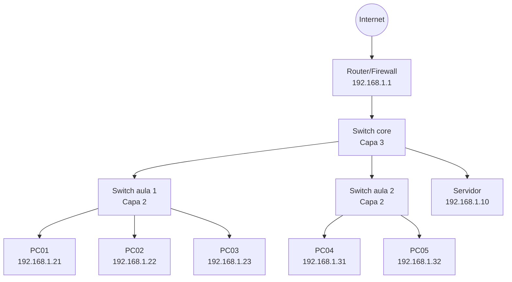
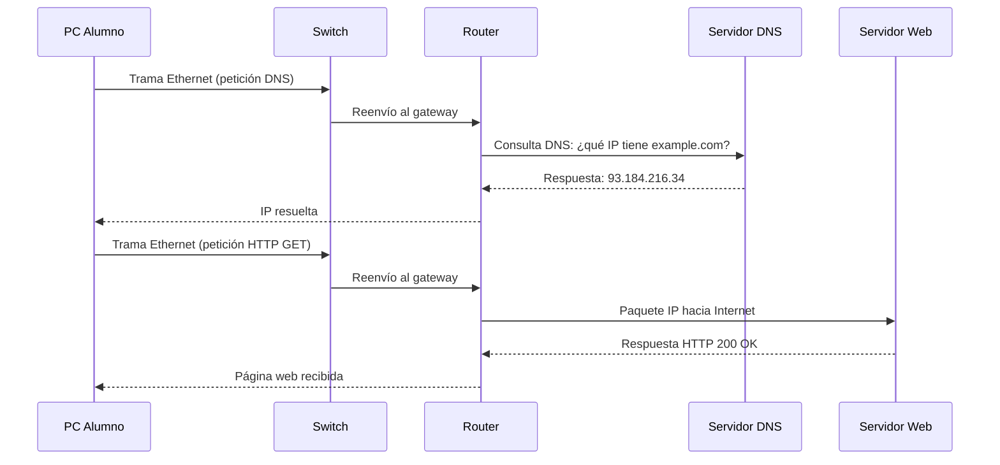

# Actividad 15: Diseño de topología de red con diagramas

| Campo | Valor |
|---|---|
| **Bloque** | M3 · Redes Locales |
| **Módulo** | 0225 RL |
| **Resultados de aprendizaje** | RA1 — Reconoce la estructura de redes locales · RA2 — Despliega el cableado en un sistema de comunicación |
| **Duración** | 4 horas |

---

## Objetivos

Al finalizar esta actividad el alumno será capaz de:

- Interpretar diagramas de topología de red.
- Identificar los equipos y sus roles en una red empresarial típica.
- Trazar el flujo de datos entre dispositivos cliente y servidores.

## Topología de la red del aula

El siguiente diagrama muestra la infraestructura de red del aula de informática:

## Flujo de una petición web

Cuando un alumno abre el navegador y accede a una página web, los paquetes recorren el siguiente camino:

## Asignación de direcciones IP

La red está segmentada en dos VLANs. Observa la tabla de direccionamiento:

| VLAN | Nombre | Red | Rango hosts | Gateway |
|------|--------|-----|-------------|---------|
| 10 | Aula 1 | 192.168.10.0/24 | .1 – .254 | 192.168.10.1 |
| 20 | Aula 2 | 192.168.20.0/24 | .1 – .254 | 192.168.20.1 |
| 99 | Servidores | 192.168.99.0/28 | .1 – .14 | 192.168.99.1 |

## Tareas

### 1. Analiza la topología

Responde las siguientes preguntas a partir del diagrama:

a) ¿Qué tipo de topología física representa el diagrama? ¿Y la lógica?
b) ¿Cuántos dominios de colisión existen en la red?
c) ¿Qué ventaja aporta el switch de capa 3 frente a uno de capa 2?

### 2. Traza una comunicación

Describe paso a paso qué ocurre a nivel de red cuando PC01 (192.168.1.21) envía un ping a PC04 (192.168.1.31). Indica:

- Protocolo utilizado
- Equipos intermedios que atraviesa el paquete
- Respuesta esperada

### 3. Rediseño con VLANs

Propón un nuevo esquema de direccionamiento que separe en VLANs distintas las dos aulas y el servidor. Dibuja el diagrama resultante (puedes usar papel, draw.io o Packet Tracer).

---

## Criterios de evaluación

| Criterio | Puntos |
|---|---|
| Respuestas al análisis de topología correctas y justificadas | 3 |
| Descripción precisa del flujo del ping | 3 |
| Propuesta de VLANs coherente con el esquema dado | 4 |
| **Total** | **10** |
